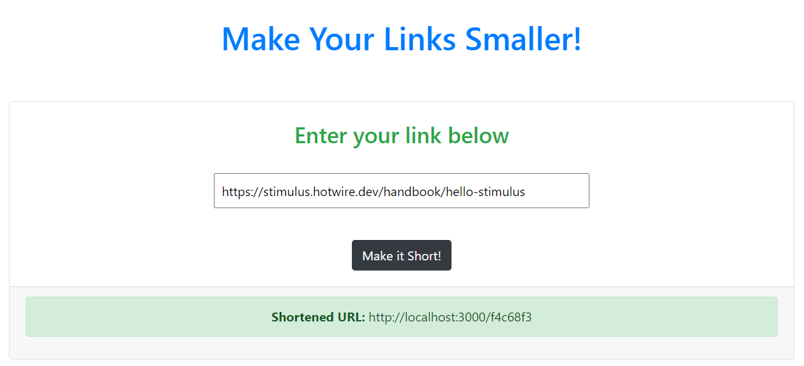

#  Chunin Exam Submission

URL Shortener app by Abhigyan Mahanta.

## Usage

This web app can be used to shorten your links just like bitly.com and tinurl.com.




# What it does

- Users can enter any link to shorten it and make it less clunky
- Enter the URL in the input box and click on 'Make it short' button to get the shortened link.

## Build-With

- Ruby -v 2.6.6
- Rails -v 5.2.4.4
- Stimulus
- VScode

## Getting Started

### Prerequisites

To get this project up and running locally, you must already have ruby and necessary gems installed on your computer

**To get this project set up on your local machine, follow these simple steps:**

1. Open Terminal.
2. Navigate to your desired location to download the contents of this repository.
3. Copy and paste the following code into the Terminal: git clone https://github.com/Abhigyan001/Chunin-Exam.git
4. Run ```cd Chunin-Exam```.
5. Run ```yarn add stimulus```.
6. Run ```bundle install``` to get the necesary gems.
7. Run `rails db:migrate`.
8. Run `rails s -p 3000`
9. Open a new terminal at the same location (Chunin-Exam folder) and Run `bin/webpack-dev-server`.
10. Now open your browser and at the address bar, type `localhost:3000`


## Author Details::

👤 ABHIGYAN Mahanta

- Github: [@Abhigyan001](https://github.com/Abhigyan001)
- Twitter: [@abhigyan_001](https://twitter.com/abhigyan_001)
- LinkedIn: [Abhigyan](https://www.linkedin.com/in/abhigyanmahanta/)

## Show your support

Give ⭐ Star me on GitHub — it helps!

## 📝 License

This project is [MIT](lic.url) licensed.   


